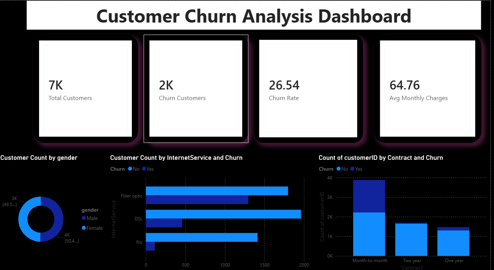

1. Project Title
2. Problem Statement
3. Technologies Used
4. Dataset Information
5. Project Workflow
6. SQL Analysis
7. Power BI Dashboard
8. Key Insights
9. Future Improvements
10. Screenshots

• Month-to-month contracts show highest churn.

• Fiber optic users churn more frequently.

• Customers with higher monthly charges are more likely to churn.

• Long-term contracts improve retention.
